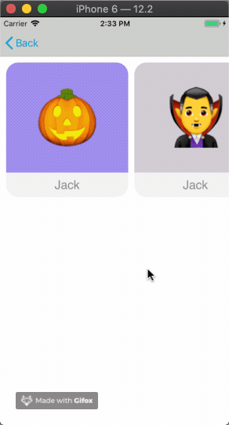

# Getting started guide

Welcome to the Container Collection getting started guide! This guide aims to help introduce you to the concepts of the framework, and give you a step-by-step guide to building your first dynamic, component-driven UI.

Note that this guide does not involve *setting up* the Framework in your application. The example used in this guide is included in the example app, and it's just intended to be an example. 

In this guide, we'll be building a new feature called **"Horizontal Rail"**, which will use rail components to display various emojis. The feature will have only one view, and we'll be building both the content and the components from scratch. The end result will look like this:




**Table of contents**

- [Creating a horizontal rail component](#creating-a-horizontal-rail-component)
- [Creating a component factory](#creating-a-content-operation-factory)
- [Register the component with the mapper](#register-the-component-with-the-mapper)
- [Creating the parent container](#creating-the-parent-container)
- [Using your new rail component](#using-your-new-rail-component)


## Creating a horizontal rail component

Let's jump over to creating the components that we'll be rendering in our UI. You're free to use any `UIViewController` for rendering a component but for this example we will be using two different kinds of components - one rendering as a horizontal rail and one that renders a hero image.

Let's start with the rail one. We recommend to take a look at the [component programming guide](Component_programming_guide.md) before you continue reading, if you haven't already done so. The aforementioned guide provides a basic understanding of how components work.

### Conform to ConfigurableComponent

Components are the visual building blocks of any view that is using the Container Collection. To define one, you create a new `UIViewController` class and conform to the `ConfigurableComponent` protocol.

```
extension HorizontalRailViewController: ConfigurableComponent {
    func configure(with data: ComponentData?) {
        guard let horizontalRailData = data as? HorizontalRailData else { return }
        self.horizontalRailData = horizontalRailData
    }
}
```

### Setup our Component ViewController

Then we are going to setup our Component views. We want to have more flexibility on tweaking our views so we just decided to go ahead with a `UICollectionView` that's added as subview of our `UIViewController`.

```
final class HorizontalRailViewController: UIViewController {

    var horizontalRailData: HorizontalRailData? {
        didSet { refreshView() }
    }

    private let collectionView: UICollectionView = {
        let layout = UICollectionViewFlowLayout()
        layout.scrollDirection = .horizontal
        layout.minimumLineSpacing = 10
        layout.sectionInset = UIEdgeInsets(top: 0, left: 10, bottom: 0, right: 10)
        layout.itemSize = CGSize(width: 200, height: 220)
        let collectionView = UICollectionView(frame: .zero, collectionViewLayout: layout)
        return collectionView
    }()

    override func viewDidLoad() {
        super.viewDidLoad()
        registerCells()
    }


    private func registerCells() {
        collectionView.register(
            HorizontalRailCell.self, 
            forCellWithReuseIdentifier: HorizontalRailCell.reuseIdentifier
        )
    }

}
```

### Data binding

For our cells we just subclassed  `UICollectionViewCell` and the last thing we need to implement before our horizontal rail component is finished and ready to use - is data binding. We'll be given a `HorizontalRailCellData` that we previously casted from `ComponentData` to bind to our view, and it's up to us to pick and choose what data in the model makes sense for our component. In this case, we'll use the `emoji` and `title` and display them using our collection view cell:

```
func configure(with data: HorizontalRailCellData) {
    backgroundColorView.backgroundColor = UIColor(
        red: data.color.red, 
        green: data.color.green, 
        blue: data.color.blue, 
        alpha: 
        data.color.alpha
    )
    emojiLabel.text = data.emoji
    titleLabel.text = data.title
}
```
And with that, we're done! We now have a fully reusable row component that we can not only use in the feature we're building now, but anywhere in our app.

## Creating a component factory

The Container Collection uses the factory pattern to build the components. In order to be able to reuse the components, each component needs to be uniquely identifieed. So for every Component, we'll need a factory that will create the component.

To create a Component factory, we create a new class and conform to `ComponentFactory`. Then, when we're asked to build the component for a given `ComponentData`, we return an instance of the `HorizontalRailViewController`:

```
class HorizontalRailFactory: ComponentFactory {
func buildComponent(using data: ComponentData) -> ConfigurableComponent? {
    guard validComponent(using: data) else { return nil }
    let controller = HorizontalRailViewController()
    controller.horizontalRailData = data as? HorizontalRailData
    return controller
}
```

In order to be able to reuse the components we are asked to provide a unique identifier. The framework is intended to be data driven so it provides the data to be able to identify the component wiht the data but it 's up to the implementation to do that. For this example we are just going to use the raw string describing the class name:

```
func identifyComponent(using data: ComponentData) -> String {
    return "\(HorizontalRailViewController.self)"
}

```

## Register the component with the mapper

Next up, we'll register our new component factory using  the `ComponentMapper`.  Factories can be registered for a given `namespace` to avoid clashing with other factories. This enables you to quickly and safely build your own components - even if you're working in a large team with several other developers.


```
class ContentMapper: GenericMapper {

    override init() {
        let horizontalRailFactory = HorizontalRailFactory()
        register(factory: HorizontalRailFactory, for id: Component.HorizontalRail.rawValue)
    }

}

```
 Let's now start using our new component!

## Creating the parent container

The container collection needs a parent `ViewController` used as a host of all the components. This parent container needs to implement either `ContainerTableView` or `ContainerCollectionView`. And it needs to conform to `ContainerCollectionControllerDelegate`. 
So let's create the ViewController:

```
class TableContainerViewController: UIViewController {

    @IBOutlet private var containerTableView: ContainerTableView!

    var elements: [Element] = []

    override func viewDidLoad() {
        super.viewDidLoad()
        setupContainerTableView()
        registerIdentifiers(from: elements)
        containerTableView.controllerData = elements
    }

    func setupContainerTableView() {
        containerTableView.controllerDelegate = self
        containerTableView.parentViewController = self
    }

    func registerIdentifiers(from elements: [Element]) {
        for element in elements {
            let id = element.factory.identifyComponent(using: element.data)
            containerTableView?.register(ContainerTableViewCell.self, forCellReuseIdentifier: id)
        }
    }

    override func viewDidAppear(_ animated: Bool) {
        super.viewDidAppear(animated)
        containerTableView.requestLayout()
    }
}

```

Let's implement the methods in the `ContainerCollectionControllerDelegate` protocol one by one and walk through what they do.

### Create the component

In order to provide the components to the Container Collection the following method needs to be implemented:

```
func createController(data: Any, forIndexPath: IndexPath) -> UIViewController {
    guard let element = data as? Element,
    let controller = element.factory.buildComponent(using: element.data) as? UIViewController else {
        return FallbackFactory().buildComponent(using: reuseIdentifier(data: data)) as! UIViewController
    }
    return controller
}

```

### Reusing the component

To optimize views for maximum performance, both in terms of speed & memory - components are reused just the same way as cells in a `UICollectionView` or `UITableView` are reused. In fact the reuse system is really just a thin layer on top of the standard cell reuse mechanism, so to be able to mantain a pool of resusable components each component must be uniquele identify to make them availiabe to the Container collection. To do so the following method needs to be implemented:

```
func reuseIdentifier(data: Any) -> String {
    guard let element = data as? Element else { return "unsupported" }
    return element.factory.identifyComponent(using: element.data)
}

```

### Updating the component

To be able to update the component when data changes and/or the component is reused  `update` method needs to be implemented.

```
func update(controller: UIViewController, data: Any, forIndexPath: IndexPath) {
    guard let element = data as? Element,
    let controller = controller as? ConfigurableComponent else { return }
    controller.configure(with: element.data)
}

```

As you have seen above, our components are just lightweight native  `UIViewController`. In this way we dont't force adpting a specific solution and clients of the container collection can reuse their existing ViewControllers.
